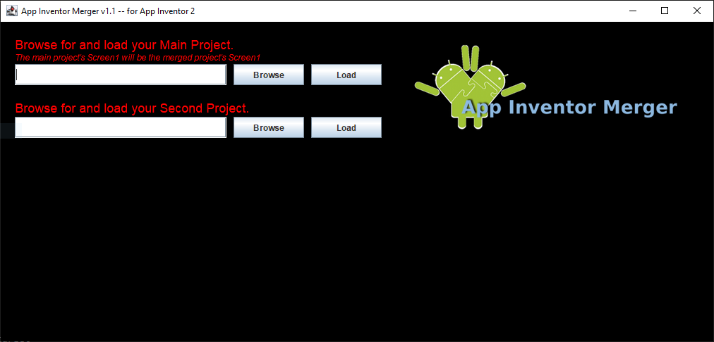

# AI2 Project Merger Tool installer

Wrapper for **AI2 Project Merger Tool**, which combine two App Inventor projects into one. This project facilitates the distribution and installation of this application.

[Download installer](https://github.com/fvarrui/AI2MergerTool/releases/download/v1.0.0/AI2MergerTool_1.0.0.exe).

Read this [article](https://appinventor.mit.edu/explore/resources/ai2-project-merger) for more information about **AI2 Project Merger Tool**.

